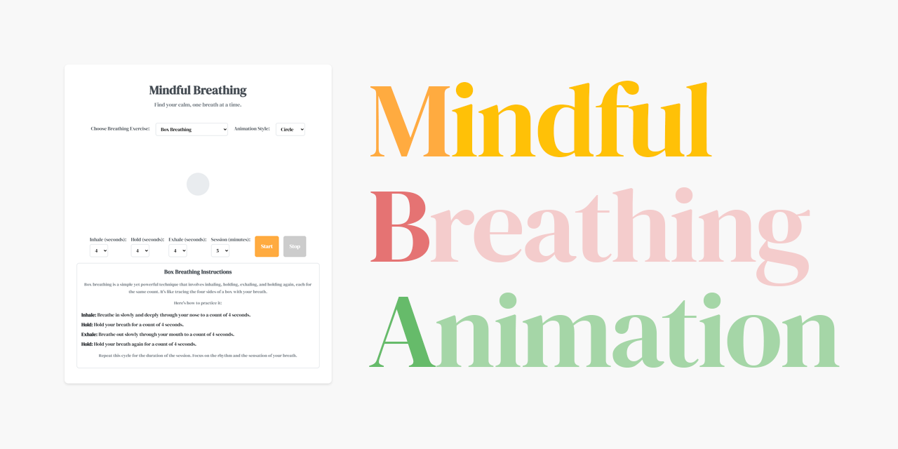

# Mindful Breathing Visualizer (v2.1.0)

  

  
  

**Reduce stress and anxiety with beautiful, customizable breathing exercises.**

This project is a massive cross-platform ecosystem designed to bring mindfulness to every device and platform. From a simple web page to a native mobile app, a terminal CLI, or a backend service—we have an implementation for you.

## 🌟 What's New in v2.1.0
-   **Immersive Audio**: Real-time sine wave synthesis (Web Audio API, AudioTrack, AVAudioEngine) synchronized with breath.
-   **Shape Customization**: Choose between **Circle**, **Square**, or **Lotus** visual anchors.
-   **Dark Mode & Haptics**: Manual toggle for dark themes and tactile vibration feedback on mobile.
-   **New Pillars**: **Vanilla PHP**, **Ruby Gem**, **Flutter**, **Ghost CMS**, and **Shopify** integrations.
-   **Portfolio Dashboard**: A central `index.html` to explore the entire ecosystem.

---

## 🚀 The Ecosystem

We support almost every major platform. All implementations share the same "Serene Palette" design system and 150Hz-200Hz audio frequency standards.

### 🌐 Web (Frontend)
| Framework | Features | Status |
| :--- | :--- | :--- |
| **[Vanilla JS (PWA)](breathing-animation/frontend/vanilla-js)** | Offline, Audio, Haptics, Dark Mode | ✅ Stable |
| **[React](breathing-animation/frontend/react)** | Hooks, Props Validation | ✅ Stable |
| **[Vue](breathing-animation/frontend/vue)** | Single File Component | ✅ Stable |
| **[Angular](breathing-animation/frontend/angular)** | Typography, Services | ✅ Stable |
| **[Svelte](breathing-animation/frontend/svelte)** | Reactive, Lightweight | ✅ Stable |
| **[Astro](breathing-animation/frontend/astro)** | Zero-JS default, Island Architecture | ✅ Stable |

### 📱 Mobile (Native)
| Platform | Tech Stack | Key Features |
| :--- | :--- | :--- |
| **[Android](breathing-animation/mobile/android)** | Kotlin + Jetpack Compose | Native `AudioTrack`, 60fps |
| **[iOS](breathing-animation/mobile/ios)** | Swift + SwiftUI | `AVAudioEngine`, Haptics |
| **[Flutter](breathing-animation/mobile/flutter)** | Dart | Cross-platform, MethodChannels |

### 🖥️ Desktop & System
| Platform | Tech Stack | Status |
| :--- | :--- | :--- |
| **[Electron](breathing-animation/desktop/electron)** | Node.js + HTML | ✅ Stable |
| **[Obsidian](breathing-animation/desktop/obsidian)** | TypeScript Plugin | ✅ Stable |
| **[CLI](breathing-animation/cli)** | Go, Rust, C++, Ruby, Python | ✅ Stable |
| **[Backend](breathing-animation/backend)** | PHP, Spring Boot, Node (MCP) | ✅ Stable |

---

## 🧪 Science & Math

Our breathing patterns are modeled using piece-wise functions (Wolfram, LaTeX) to ensure smooth transitions that mimic natural respiratory sinus arrhythmia (RSA).

-   **Box Breathing**: 4s Inhale, 4s Hold, 4s Exhale, 4s Hold.
-   **Diaphragmatic**: Deep belly breathing for relaxation.
-   **Alternate Nostril**: Balancing left/right hemispheres.

## 🤝 Contributing

We welcome contributors! Please read our [CONTRIBUTING.md](CONTRIBUTING.md) for details on our coding standards ("Mindful" > "Zen"), security practices (Immutability), and build instructions.

## 🛡️ Security

We take security seriously. All implementations feature:
-   **Input Sanitization**: strict typing and validation.
-   **Immutability**: `Object.freeze()` and constant data structures.
-   **Isolation**: No leaky global state.

See [SECURITY_BEST_PRACTICES.md](breathing-animation/docs/SECURITY_BEST_PRACTICES.md) for integration guides.

---

**Just Breathe.** 🧘‍♂️
