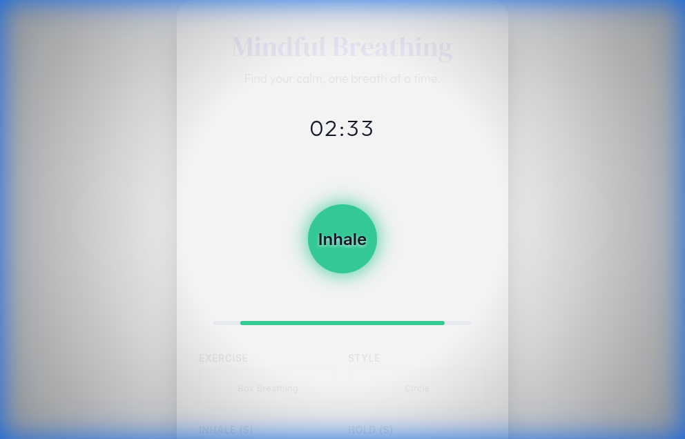
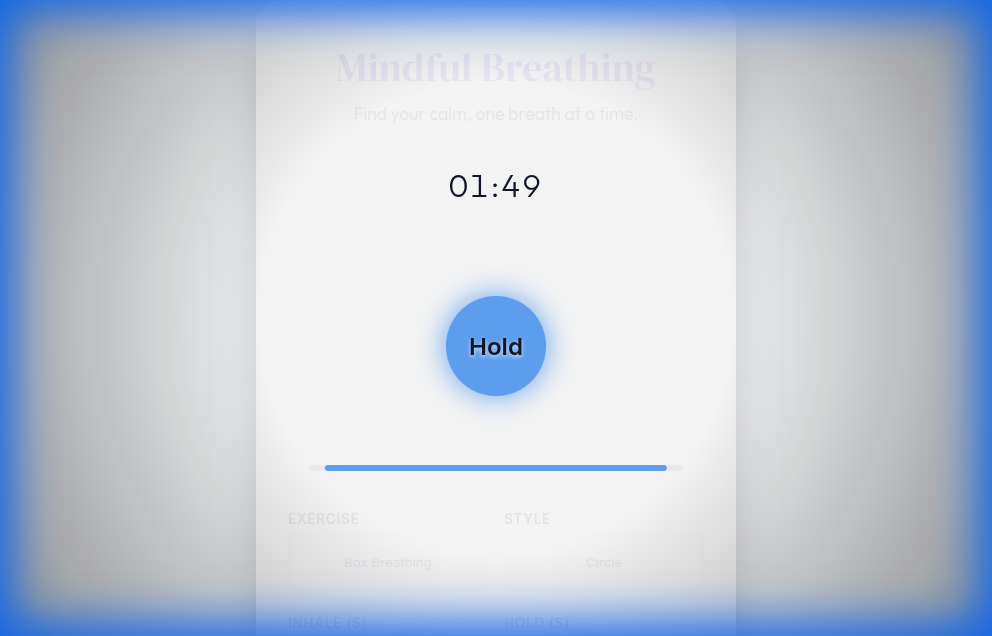
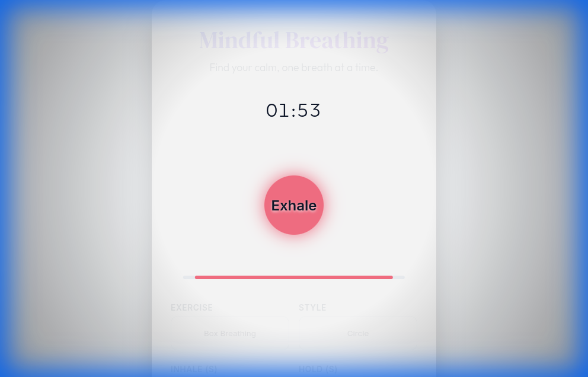
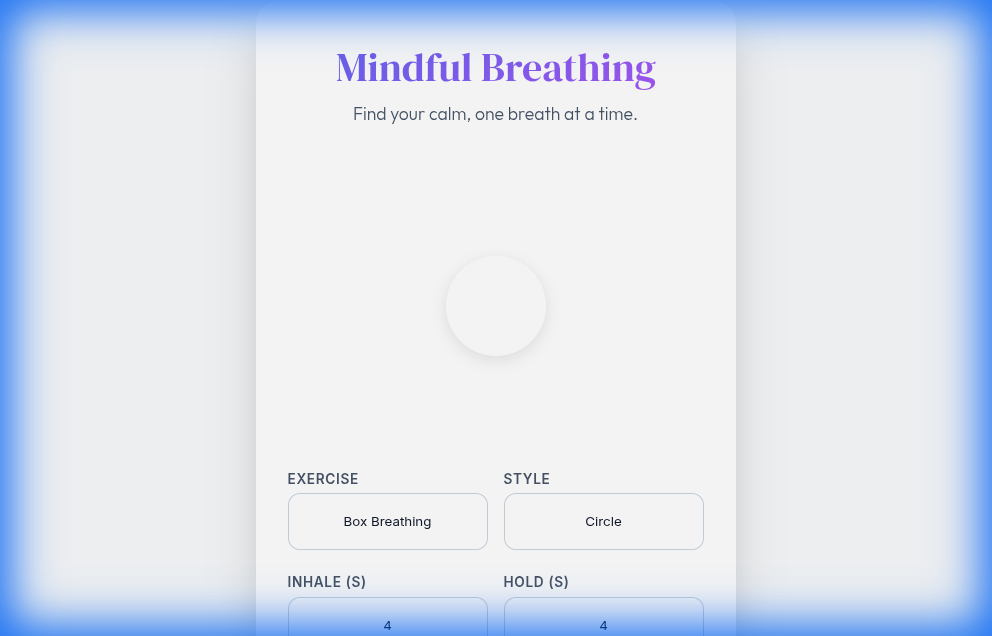
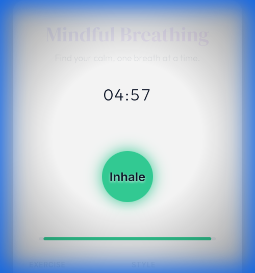
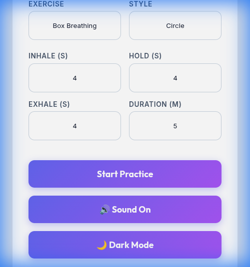

# Mindful Breathing Visualizer (v3.2.0)

<p align="center">
  
</p>

<p align="center">
  </a>
  <a href="https://github.com/philgear/mindful-breathing-visualizer/releases/tag/v3.0.0">
     
  </a>
  <a href="LICENSE">
     
  </a>
  <a href="https://github.com/philgear/mindful-breathing-visualizer/graphs/contributors">
     
  </a>
  <a href="breathing-animation/docs/DATA_CARD.md">
     
  </a>
</p>

---

## 🧘 Who (Audience & Creators)
**Who is this for?**
*   **The Busy Developer**: You live in the terminal. You need a 5-minute reset without context-switching to a mobile app.
*   **The Everyday Human**: You are taking a break or encountering a moment of stress. You need a simple, immediate tool to help you reground.
*   **The Daily Commuter**: You need an offline-ready, privacy-first tool that works on 3G.
*   **The Biohacker**: You want scientifically-rigorous 150Hz customization to sync with your HRV monitor.

**Who made this?**
Maintained by **Phil Gear** and an open-source community dedicated to mental resilience.

---

## 🌿 What (The Ecosystem)
**New in v3.1.0 "The Minimalist Edition"**: The **Mindful Breathing Visualizer** has been completely overhauled to follow the **"Less, but better"** design philosophy.
*   **Minimalist Aesthetic**: A strict monochromatic palette with a single **International Orange** interaction accent. No gradients, no shadows, no distractions.
*   **Stereo Balance Indicator**: A new high-fidelity UI for Alternate Nostril Breathing that mimics analog audio equipment.
*   **Pure Function**: Emojis and decorative text stripped away. Information is conveyed through clear, geometric signals.
*   **Smart Durations**: Context-aware defaults (Box=4s, 4-7-8=4s/7s/8s, Diaphragmatic=Relaxing).
*   **150Hz Audio Sync**: Real-time sine wave synthesis that rises/falls with breath.
*   **Scientific Rigor**: Animations modeled on piece-wise respiratory sinus arrhythmia (RSA) functions.

### 🌌 The "Serene Palette" Across 39+ Dimensions
We have ported the **exact same** 150Hz sine-wave logic and "Serene Palette" design to **every major stack** to prove that mindfulness is universal.

#### 🎨 Frontend (The Visuals)
*   **Core**: `Vanilla JS` (Standard), `TypeScript`, `Web Components`
*   **Frameworks**: `React`, `Vue`, `Svelte`, `Angular`, `Astro`
*   **Creative**: `P5.js` (Generative Art)
*   **CMS / E-commerce**: `Ghost` (Theme), `Shopify` (Liquid), `Storyblok`
*   **Embedded**: `HTML-Only` (No-JS fallback)

#### 📱 Native & Desktop (The App)
*   **Mobile**: `Kotlin` (Android Native), `Swift` (iOS Native), `Flutter` (Cross-Platform)
*   **Desktop**: `Tauri` (Linux/macOS/Windows), `Electron` (App), `Obsidian` (Plugin), `VSCode` (Extension)

#### 📟 CLI (The Terminal)
*   **Systems**: `Rust` (TUI), `Zig` (Math Optimized), `Go`, `C++`, `Java`
*   **Scripting**: `Python`, `Ruby`, `Lua`, `Perl`, `Bash`

#### 📐 Math & Science (The Proof)
*   **Computation**: `Python` (JAX/NumPy), `Julia`, `R`, `Wolfram Language`
*   **Visual**: `LaTeX` (TikZ), `Jupyter Notebooks`

#### ☁️ Backend & Ops (The Cloud)
*   **API**: `Spring Boot` (Java)
*   **Infrastructure**: `Kubernetes` (Manifests), `Docker`
*   **Protocol**: `MCP Server` (Model Context Protocol)

---

## 🛡️ Why (Validated Science & Math)
**Validated Science**
Our design constraints (5+ minute duration, guidance cues, slow pacing) are aligned with the framework established by **Bentley et al. (2023)** in their systematic review of 58 clinical studies.
> *Source: "Breathing Practices for Stress and Anxiety Reduction: Conceptual Framework of Implementation Guidelines." Brain Sci. 2023, 13, 1612. [DOI: 10.3390/brainsci13121612](https://doi.org/10.3390/brainsci13121612)*

**The Math**
We model the breath using piece-wise functions to ensure smooth transitions that mimic natural RSA:
$$
f(t) = \begin{cases} 
0.5 - 0.5 \cos(\frac{\pi t}{4}) & 0 \le t < 4 \quad (\text{Inhale}) \\
1 & 4 \le t < 8 \quad (\text{Hold}) \\
0.5 + 0.5 \cos(\frac{\pi (t-8)}{4}) & 8 \le t < 12 \quad (\text{Exhale}) \\
0 & 12 \le t < 16 \quad (\text{Hold})
\end{cases}
$$

---

## 🚀 How (Quick Start)

### 📸 Gallery
<p align="center">
  
  
  
  
</p>

### 📱 Mobile (Responsive)
<p align="center">
  
  
</p>

### 🌐 Web (Universal)
Simply open the portable `index.html` in any modern browser. No build required.
```bash
open index.html
```

### 💻 Terminal (Rust CLI)
The Gold Standard for TUI performance.
```bash
cd breathing-animation/cli/rust
```bash
cargo run --release
```

### 🐍 Python (Universal)
Runs everywhere with zero fuss.
```bash
python3 breathing-animation/cli/python/breathing.py
```

### 🐹 Go (Simplicity)
Single binary, instant startup.
```bash
go run breathing-animation/cli/go/main.go
```

### 🐳 Docker (Infrastructure)
Deploy the full stack container.
```bash
docker build -t breathing-visualizer -f infrastructure/kubernetes/Dockerfile .
docker run -p 8080:80 breathing-visualizer
```

---

## 🤝 Contributing
See [CONTRIBUTING.md](CONTRIBUTING.md).

<p align="center">
  <i>"Practicing mindfulness, one byte at a time."</i>
</p>
