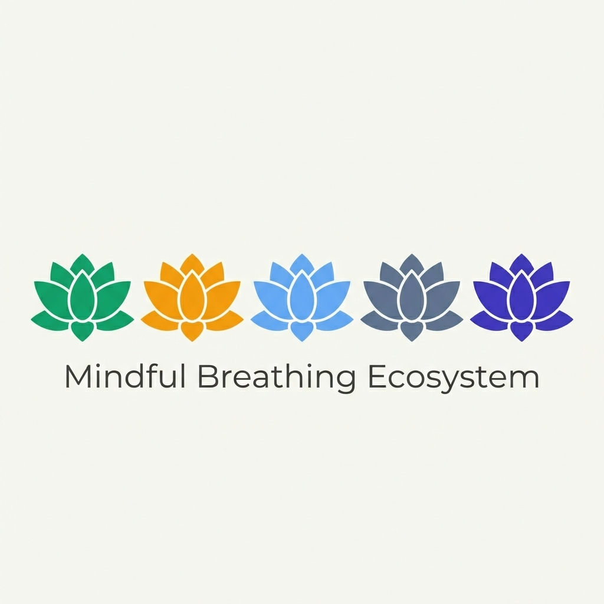

# Mindful Breathing Visualizer

A collection of breathing exercise visualizers implemented in various languages and frameworks.

## Project Structure

### 🎨 Frontend

Web implementations of the breathing visualizer.

- **Angular**: `frontend/angular`
- **Astro**: `frontend/astro`
- **React**: `frontend/react`
- **Svelte**: `frontend/svelte`
- **Vue**: `frontend/vue`
- **Vanilla JS**: `frontend/vanilla-js`
- **P5.js**: `frontend/p5-sketch`
- **Web Components**: `frontend/web-components`

### ⚙️ Backend

Server-side implementations and plugins.

- **Spring Boot**: `backend/spring-boot`
- **WordPress Plugin**: `backend/wordpress`
- **MCP Server**: `backend/mcp-server`

### 🖥️ CLI & Scripting

Command-line interfaces with ANSI TrueColor and Audio support.

- **Bash**: `cli/bash`
- **C++**: `cli/cpp`
- **Go**: `cli/go`
- **Java**: `cli/java`
- **Lua**: `cli/lua` (New)
- **Perl**: `cli/perl` (New)
- **Python**: `cli/python`
- **Ruby**: `cli/ruby`
- **Rust**: `cli/rust`

### 📱 Mobile

Native and Cross-Platform implementations.

- **Android (Kotlin)**: `mobile/android`
- **iOS (Swift)**: `mobile/ios`
- **Flutter**: `mobile/flutter`

### 💻 Desktop

Desktop integrations.

- **Electron Tray App**: `desktop/electron`
- **VS Code Extension**: `desktop/vscode`
- **Obsidian**: `desktop/obsidian`

### 🌐 Browser Extensions

- **Chrome Extension**: `browser/chrome`

### 📐 Math & Scientific

Mathematical models and high-performance visualizations.

- **Wolfram**: `math/wolfram`
- **LaTeX**: `math/latex`
- **JAX**: `math/jax`
- **Julia**: `math/julia` (New)
- **R**: `math/r` (New)
- **Notebooks**: `notebooks/`

### ☁️ Infrastructure

- **Kubernetes**: `infrastructure/kubernetes` (Deployment, Service, Dockerfile)
- **Docker**: `infrastructure/docker`

## SWEBOK v4 & Scientific Easing Compliance

As of 2026, this project adheres to strict software engineering and scientific guidelines:

- **Scientific Easing (Bentley et al., 2023)**: Animation curves are mathematically modeled on the piecewise cosine function via `cubic-bezier(0.37, 0, 0.63, 1)`. Hold states preserve a static scale (color-only transition), and session defaults start at 5+ minutes.
- **Visuals (KA 2.1)**: All implementations use the **Serene Palette** (Inhale: Emerald `#34d399`, Hold: Blue `#60a5fa`, Exhale: Rose `#fb7185`).
- **Audio (KA 2)**: All interactive implementations feature standardized 150Hz audio feedback for accessibility.
- **Polyglot Rigor**: 39 distinct implementations across 10+ ecosystems.

## License

MIT
